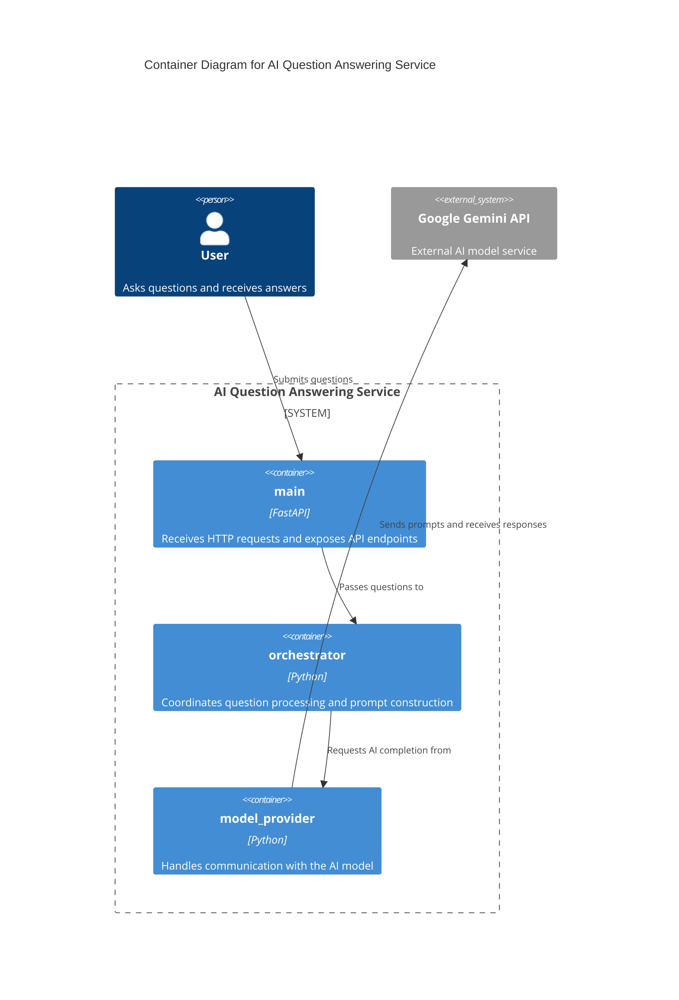

# AI Question Answering Service

## System Architecture

```mermaid
C4Container
    title Container Diagram for AI Question Answering Service

    Person(user, "User", "Asks questions and receives answers")

    System_Boundary(ai_service, "AI Question Answering Service") {
        Container(main, "main", "FastAPI", "Receives HTTP requests and exposes API endpoints")
        Container(orchestrator, "orchestrator", "Python", "Coordinates question processing and prompt construction")
        Container(model_provider, "model_provider", "Python", "Handles communication with the AI model")
    }

    System_Ext(gemini, "Google Gemini API", "External AI model service")

    Rel(user, main, "Submits questions")
    Rel(main, orchestrator, "Passes questions to")
    Rel(orchestrator, model_provider, "Requests AI completion from")
    Rel(model_provider, gemini, "Sends prompts and receives responses")
```
